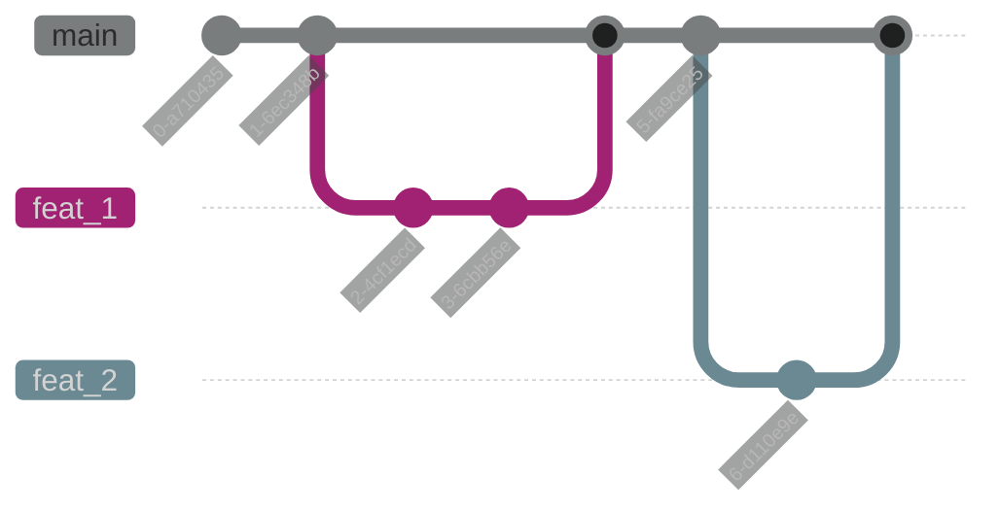

# Projekt as6

# Services (Projekte)

Folgende Projekte werden mit diesem Git Repository verwaltet.

* [engine-service](https://wiki.bedag.ch/display/SRE/TBD)
* [Weitere Dokumentation bezüglich Kubernetes](https://wiki.bedag.ch/display/K8s/Documentation)

# Auto-Renew GitLab Token Einrichtung

Wir nutzen für unseren Flux GitLab Zugriff nun sich selbst aktualisierende Tokens. Dieser Abschnitt beschreibt die nötigen Schritte, die für die Einrichtung durchgeführt werden müssen.

## 1. Schritt: Token in Git Projekt anlegen
Im linken Menü des GitLab Projektes unter "Settings" den Punkt "Access Tokens" auswählen.  
Anschliessend mit "Add new token" ein neues Token anlegen.  
  
### Einstellungen:  
- **Token Name:** as6-gitlab-(Stufe)-autorenew
- **Expiration date:** Setzt es ruhig auf eine Woche später, das Objekt wird sowieso überschrieben mit den Werten von unten (30/10)
- **Select a role:** Developer
- **Select scopes:** self_rotate, read_repository

Anschliessend Token erstellen mit "Create project access token", dieses kopieren und in der untenstehenden YAML (2. Schritt) einsetzen.

## 2. Schritt: Token auf dem Namespace konfigurieren
YAML Beispiel:

```yaml
apiVersion: scm.bedag.ch/v1alpha1
kind: GitlabToken
metadata:
  name: as6-gitlab-token
spec:
  duration: 30
  gitlabInstance: git.mgmtbi.ch
  initialToken: glpat-XXX # <-- Hier das Token von oben eintragen
  rotateBefore: 10
  secretName: as6-gitlab-token-autorenew
```
Weitere Informationen zu dieser Funktionalität finden sich in der [Cloud Dokumentation](https://control.ci-bedag.ch/user-docs/cloudservices/gitops/argocd/explanations/gitlabtoken#gitlab-access-token).
  
Das Token muss in jedem Namespace und pro Stufe erstellt werden.
```
k apply -f <Pfad zur obigen YAML>
```
Das Secret wird anschliessend im Namespace angelegt.
## 3. Schritt: Vorgang dokumentieren
Bitte dokumentiert [hier](https://wiki.bedag.ch/x/IwuDaw), dass ein neues Token angelegt wurde.

# GitFlow

> Der Gitflow wird sich in Zukunft noch anpassen, da die Toolchain noch in Entwicklung ist.

Es werden nur Commits auf dem `main` Branch für die Reconcilation in betracht gezogen. Änderungen werden über feature branches entwickelt und via Merge Request in den `main` Branch übertragen.



## Pre-Commit

Wir verwenden Pre-commit, um sicherzustellen, dass Kustomize sowie andere checks an den manifesten durchgeführt werden. Pre-Commit muss auf dem Client installiert werden:

* [https://pre-commit.com/](https://pre-commit.com/)

Die Hook muss im Repository jeweils noch installiert werden:

```bash
 pre-commit install
```
